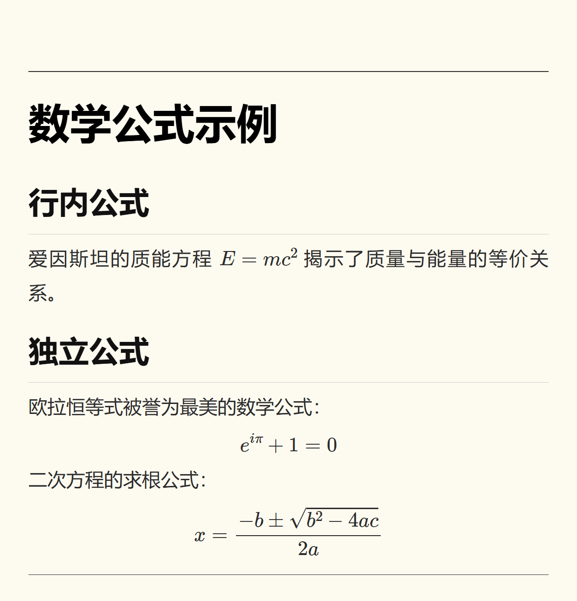
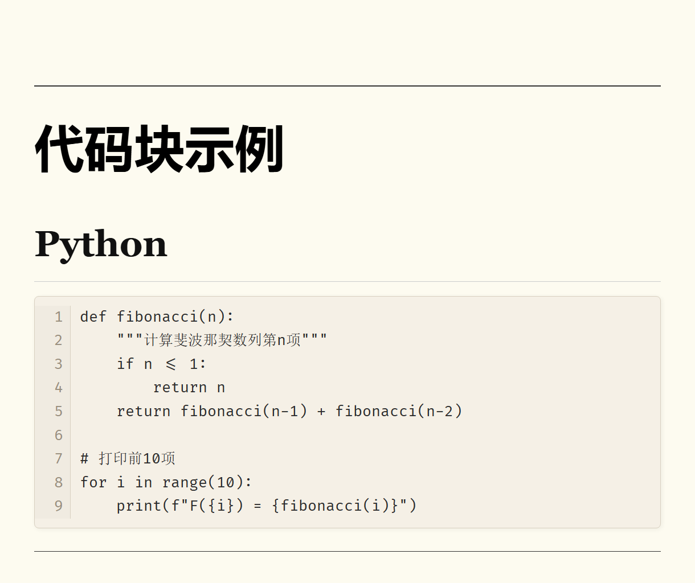
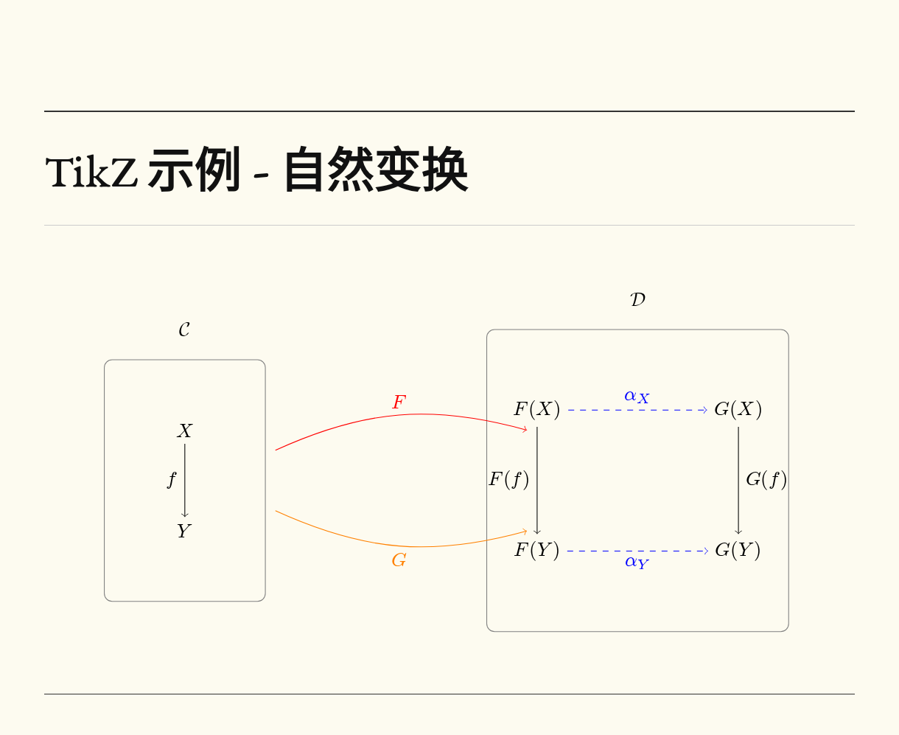

# MathJax2Image

将 Markdown/MathJax 内容渲染为精美图片的 AstrBot 插件。

## 命令

- `/math <主题>` - 调用 LLM 生成数学文章，支持 LaTeX 公式渲染
- `/art <主题>` - 调用 LLM 生成普通文章
- `/render <内容>` - 直接渲染 Markdown/LaTeX 内容为图片

**示例：**
```
/math 勾股定理的证明
/art 人工智能的发展历程
/render $E=mc^2$ 是爱因斯坦的质能方程
```

## 安装

### 1. 安装依赖
```bash
pip install -r requirements.txt
playwright install chromium
```

### 2. MathJax 自动安装
插件首次加载时会自动下载 MathJax 离线包（约 1.1MB），无需手动操作。

如果自动下载失败，可手动下载：
1. 访问 https://cdn.jsdelivr.net/npm/mathjax@3/es5/tex-chtml.js
2. 保存到 `static/mathjax/tex-chtml.js`

## 特性

- **LaTeX 公式渲染** - 支持行内公式 `$...$` 和独立公式 `$$...$$`
- **TikZ 图形渲染** - 支持 `tikzpicture`、`tikzcd` 等环境，自动检测所需库
- **Markdown 智能预处理** - 自动修复格式问题，确保正确渲染
- **代码块行号** - 代码块自动显示行号，长代码自动换行
- **可配置背景色** - 支持自定义模板背景颜色
- **离线渲染** - MathJax 和 TikZJax 本地运行，无需外部 CDN

## 效果展示

### 数学公式



### 代码块



### TikZ 图形



**TikZ 示例代码：**
```latex
/render
\begin{tikzpicture}[scale=1.8]
  % 左侧范畴 C
  \draw[gray, rounded corners] (-0.8,-1.2) rectangle (0.8,1.2);
  \node at (0,1.5) {$\mathcal{C}$};
  \node (X) at (0,0.5) {$X$};
  \node (Y) at (0,-0.5) {$Y$};
  \draw[->] (X) -- (Y) node[midway,left] {$f$};

  % 右侧范畴 D
  \draw[gray, rounded corners] (3,-1.5) rectangle (6,1.5);
  \node at (4.5,1.8) {$\mathcal{D}$};

  % F 映射的对象
  \node (FX) at (3.5,0.7) {$F(X)$};
  \node (FY) at (3.5,-0.7) {$F(Y)$};

  % G 映射的对象
  \node (GX) at (5.5,0.7) {$G(X)$};
  \node (GY) at (5.5,-0.7) {$G(Y)$};

  % 态射
  \draw[->] (FX) -- (FY) node[midway,left] {$F(f)$};
  \draw[->] (GX) -- (GY) node[midway,right] {$G(f)$};
  \draw[->, blue, dashed] (FX) -- (GX) node[midway,above] {$\alpha_X$};
  \draw[->, blue, dashed] (FY) -- (GY) node[midway,below] {$\alpha_Y$};

  % 函子箭头
  \draw[->, red, bend left=20] (0.9,0.3) to node[above] {$F$} (3.4,0.5);
  \draw[->, orange, bend right=20] (0.9,-0.3) to node[below] {$G$} (3.4,-0.5);
\end{tikzpicture}
```

## 配置

在 AstrBot 插件配置中可设置：

- `background_color` - 模板背景颜色（默认 `#FDFBF0`）
- `math_system_prompt` - 数学文章提示词
- `article_system_prompt` - 普通文章提示词

## 支持

[AstrBot 帮助文档](https://astrbot.app)

## 致谢

- [obsidian-tikzjax](https://github.com/artisticat1/obsidian-tikzjax) - 提供支持 AMS 字体的 TikZJax 实现
- [MathJax](https://www.mathjax.org/) - 数学公式渲染引擎
- [BaKoMa Fonts](http://www.ctan.org/pkg/bakoma-fonts) - TeX 字体
