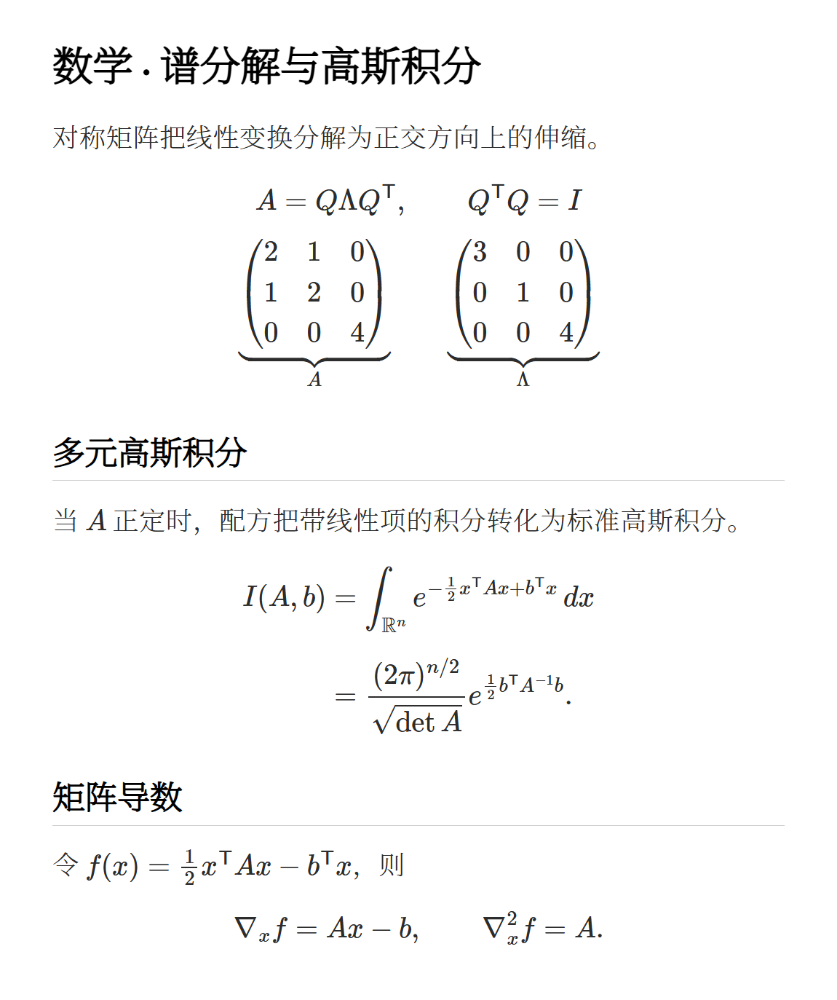
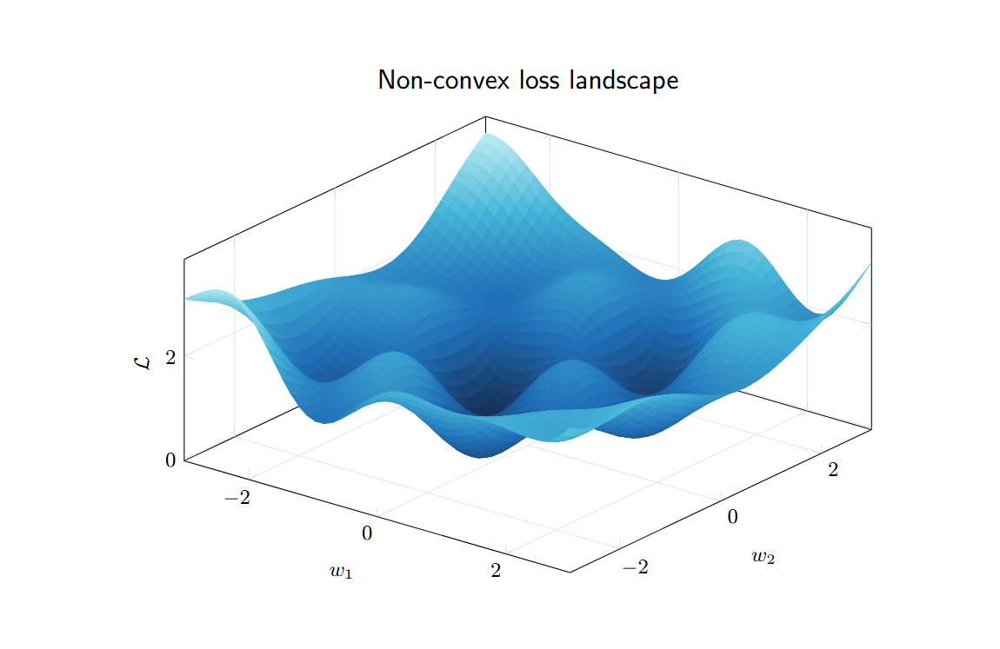
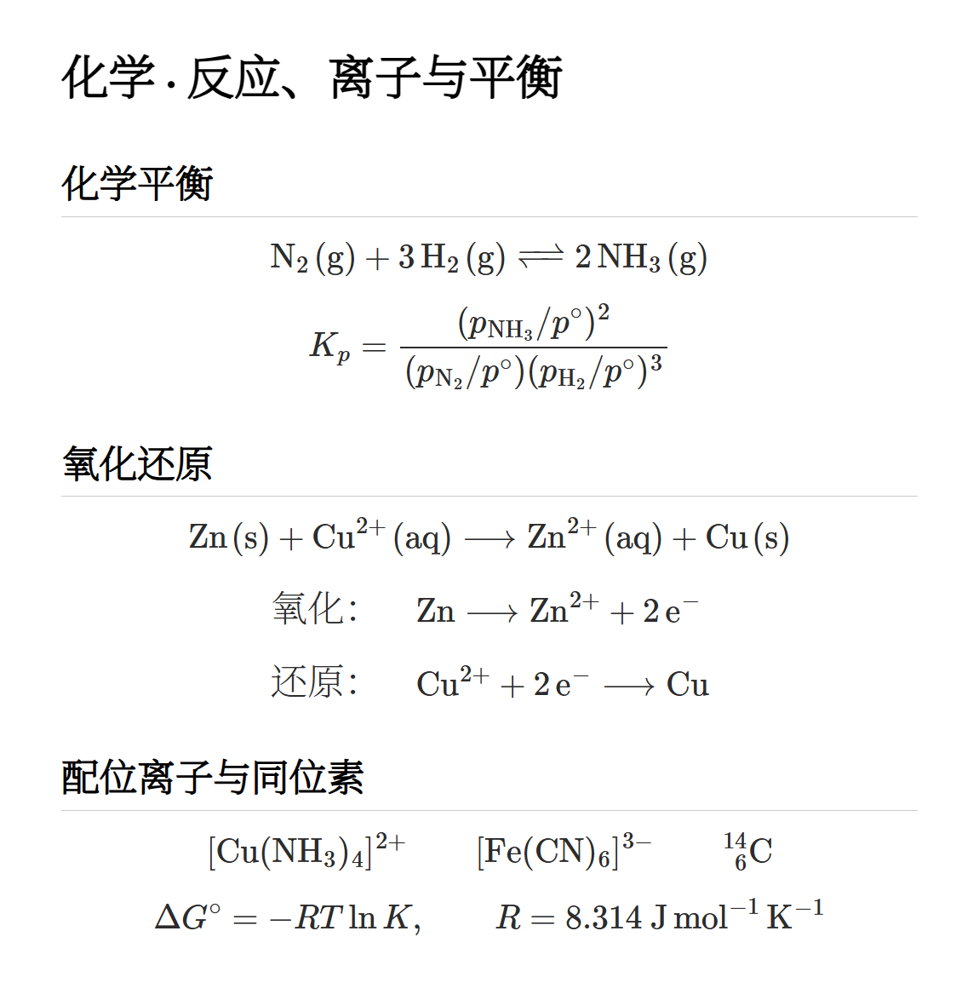
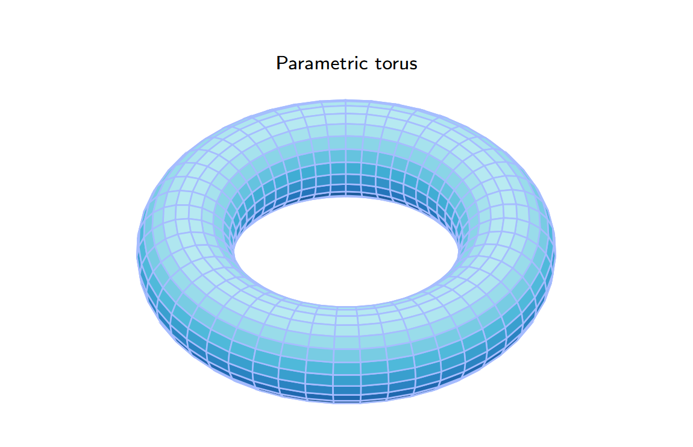
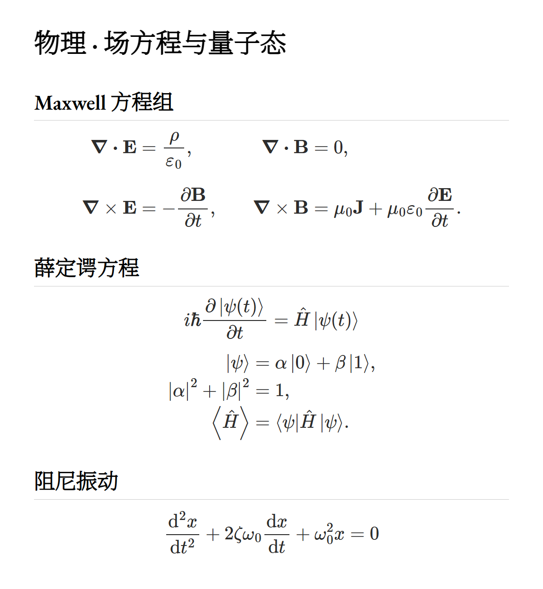
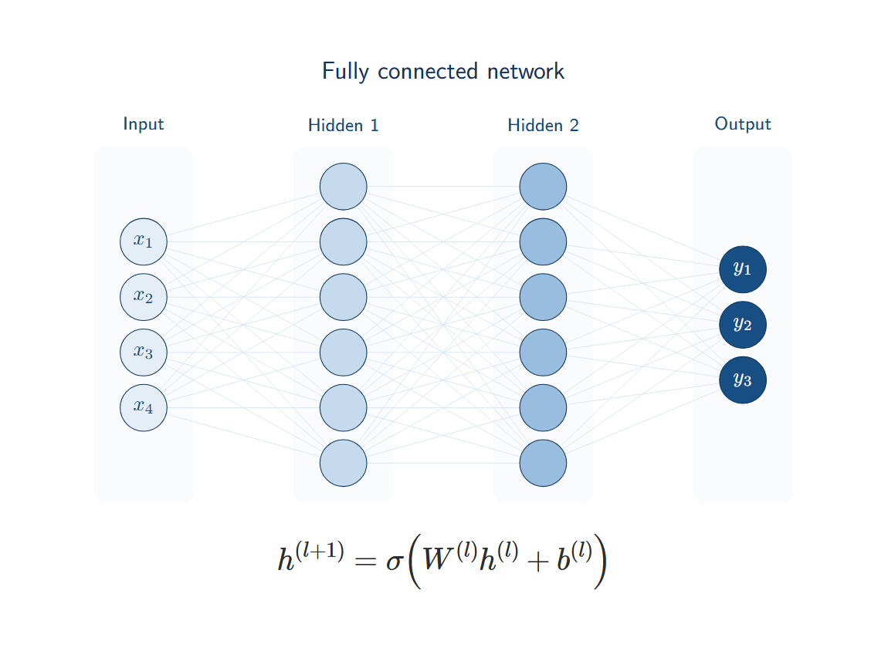

# MathJax2Image

将 Markdown、LaTeX 公式、TikZ / PGFplots 和 Mermaid 图表渲染为 PNG 的 AstrBot 插件。

[安装](#安装) · [命令](#命令) · [效果展示](#效果展示) · [扩展包](#扩展包) · [配置](#配置) · [性能验证](#性能验证)

> 喜欢的话可以给个 Star 喵，有问题欢迎提 Issue/PR。

## 特性

- **公式与图表**：支持行内 / 独立公式、化学反应式、物理公式、TikZ 二维与三维图形、Mermaid。
- **Markdown 排版**：支持标题、列表、表格和带行号的代码块，可配置背景色、正文字号及标题比例。
- **按需加载与常驻引擎**：相同配置的任务复用 MathJax / TikZ 引擎，空闲时自动回收；资源和近期图片分别缓存。
- **并发与内存控制**：合并相同请求，限制排队及重型 TikZ 并发，自动回收空闲页面。
- **密集绘图优化**：预计算支持的函数采样，保留网格精度，修复深层 SVG 的着色与裁剪。

## 安装

### 1. 安装依赖

```bash
pip install -r requirements.txt
python -m playwright install chromium --only-shell
```

Linux 系统依赖应在部署阶段安装，插件运行时不会执行 `apt-get`：

```bash
playwright install-deps chromium
```

### 2. CDN 资源

MathJax 3.2.2、TikZJax beta24 和 Mermaid 10.9.3 使用固定版本 CDN；字体来自阿里云 OSS。首次使用仍需联网，后续在插件进程内复用资源。

### 3. 可选：使用 TinyTeX 原生绘图

默认 `tikz_backend = wasm`，保持原来的安装方式。选择 `native` 后，TikZ 改用外部 TinyTeX / TeX Live 的 **latex（pdfTeX）→ DVI → dvisvgm → SVG**，普通公式仍由 MathJax 渲染。插件不附带、不自动下载 TeX，也不新增 Python 运行依赖。

1. 自行安装 [TinyTeX](https://yihui.org/tinytex/) 或使用已有 TeX Live。精简安装可先补齐下面的绘图依赖：

   ```bash
   tlmgr option docfiles 0
   tlmgr option srcfiles 0
   tlmgr install latex-bin standalone pgfplots amsmath amsfonts dvisvgm dvips infwarerr ltxcmds iftex
   ```

2. 在插件配置中把 `tikz_backend` 设为 `native`，`native_tex_bin` 填写**同时包含 latex 和 dvisvgm 的目录**，例如 `/opt/TinyTeX/bin/x86_64-linux` 或 `C:/tools/TinyTeX/bin/windows`。留空则从 AstrBot 进程的 `PATH` 查找。
3. 重载插件，用 `/render` 发送 TikZ 示例。原生模式依旧使用下方宏包 / 库白名单；需要时由管理员用 `tlmgr install tikz-cd tikz-3dplot hf-tikz` 等命令补装对应包。

缺少可执行文件、宏包、转换依赖或编译超时时，会记录原因并将本次文档回退到 WASM。原生成功时不加载 TikZJax 脚本及字体，仍受 `max_concurrent_tikz` 控制；`tikz_timeout` 分别约束原生编译阶段和回退后的 WASM 阶段。取消任务会结束正在运行的原生编译进程。切回 `wasm` 并重载即可恢复默认路径。

此后端使用已验证的普通 pdfTeX 路线，不需要安装 LuaLaTeX 或 Poppler。DVI 转 SVG 的 PGF 绘图可能需要 Ghostscript；本次 Windows TinyTeX 安装自带该依赖，其他平台需按发行版配置。下方约 232 MiB 是含 Lua 测试环境的磁盘占用，并非插件包增加的大小或所有平台的最低安装体积。

**部署边界：** 原生 TeX 是本机程序。插件禁用 shell escape、限制文件访问、过滤常见危险指令并使用临时目录，但这些措施不构成完整沙箱。接收不可信用户输入时，应把启用原生后端的 AstrBot 部署在无敏感挂载、低权限的隔离容器中；默认 WASM 路线仍可直接使用。

## 命令

- `/math <主题>` - 调用 LLM 生成数学文章，支持 LaTeX 公式渲染
- `/art <主题>` - 调用 LLM 生成普通文章
- `/render <内容>` - 直接渲染 Markdown/LaTeX 内容为图片

**示例：**

```text
/math 勾股定理的证明
/art 人工智能的发展历程
/render $E=mc^2$ 是爱因斯坦的质能方程
```

### Mermaid

支持 ```` ```mermaid ```` 代码块；CDN 优先 unpkg，失败回退 jsdelivr。离线环境需自行保证浏览器可访问 Mermaid 脚本。

## 效果展示

以下图片均由当前插件实际渲染。点击示例标题查看完整源码，复制内容后加上 `/render` 即可使用。示例使用白底；损失曲面为合成函数，网络图为结构示意。

| 公式与排版 | TikZ 绘图 |
| --- | --- |
| [数学：谱分解、高斯积分与 Hessian](examples/math.md)<br> | [非凸损失曲面：48 × 48 采样](examples/ml_surface.md)<br> |
| [化学：反应、离子与平衡](examples/chemistry.md)<br> | [参数圆环：48 × 24 采样](examples/torus.md)<br> |
| [物理：场方程、量子态与阻尼振子](examples/physics.md)<br> | [全连接网络：4–6–6–3](examples/neural_network.md)<br> |

重新生成全部示例：`python scripts/render_showcase.py`（需要浏览器及 CDN 网络）。

## 扩展包

普通扩展通过 MathJax 自动加载，例如 `\ce{H2O}`、`\cancel{x}`。也可在公式前声明包：

```latex
\usepackage{physics,mhchem,cancel,upgreek,centernot}
$$\dv[2]{x}{t} + \pdv{f}{x}$$
$$\ce{2H2 + O2 -> 2H2O}$$
$$\cancel{x} + \upalpha \centernot\implies y$$
```

显式声明支持：`ams`、`amscd`、`bbox`、`boldsymbol`、`braket`、`cancel`、`cases`、`centernot`、`color`、`empheq`、`enclose`、`extpfeil`、`gensymb`、`mathtools`、`mhchem`、`newcommand`、`physics`、`textcomp`、`textmacros`、`unicode`、`upgreek`、`verb`。

常见 LaTeX 包名也可使用：`amsmath` / `amsfonts` / `amssymb` 映射到 `ams`，`bm` 映射到 `boldsymbol`，`xcolor` 映射到 `color`。不支持的包和带选项的 `\usepackage[...]{...}` 会明确报错。

`physics` 会改变部分命令语法，须显式声明（或在公式中使用 `\require{physics}`）；此时使用完整的导数、括号与向量命令，并移除冲突的简化宏。`physics` 和 `braket` 不能同时声明：前者使用 `\braket{a}{b}`，后者使用 `\braket{a|b}`。

这不是完整 TeX 安装，不能加载任意 CTAN 包；TikZ 可用包仍受插件白名单限制，`circuitikz` 仍不支持。参见 [MathJax 3.2 扩展文档](https://docs.mathjax.org/en/v3.2/input/tex/extensions.html)。

### TikZ / PGFplots 支持清单

TikZ 与 MathJax 使用不同引擎。下面是两个 TikZ 后端共用的加载白名单，不表示每个库的全部高级功能都已逐项测试。常用依赖会自动检测；需要显式指定时，把声明写在 `tikzpicture` 环境内，插件会提取并加载：

```latex
\begin{tikzpicture}
\usepackage{pgfplots}
\usetikzlibrary{arrows.meta,positioning}
\pgfplotsset{compat=1.16}
\begin{axis}[view={40}{40}]
\addplot3[surf,shader=flat,samples=25,domain=-2:2] {x^2+y^2};
\end{axis}
\end{tikzpicture}
```

**可加载宏包（17 个）：** `amsbsy`、`amsfonts`、`amsgen`、`amsmath`、`amsopn`、`amssymb`、`amstext`、`array`、`etoolbox`、`expl3`、`hf-tikz`、`ifthen`、`pgfcalendar`、`pgfplots`、`tikz-3dplot`、`tikz-cd`、`xparse`。

<details>
<summary>展开完整 TikZ 库清单（75 个）</summary>

`3d`、`angles`、`animations`、`arrows`、`arrows.meta`、`automata`、`babel`、`backgrounds`、`bending`、`calc`、`calendar`、`cd`、`chains`、`circuits`、`circuits.ee`、`circuits.ee.IEC`、`circuits.logic`、`circuits.logic.CDH`、`circuits.logic.IEC`、`circuits.logic.US`、`datavisualization`、`datavisualization.3d`、`datavisualization.barcharts`、`datavisualization.formats.functions`、`datavisualization.polar`、`datavisualization.sparklines`、`decorations`、`decorations.footprints`、`decorations.fractals`、`decorations.markings`、`decorations.pathmorphing`、`decorations.pathreplacing`、`decorations.shapes`、`decorations.text`、`er`、`fadings`、`fit`、`fixedpointarithmetic`、`folding`、`fpu`、`graphs`、`graphs.standard`、`intersections`、`lindenmayersystems`、`math`、`matrix`、`mindmap`、`patterns`、`patterns.meta`、`perspective`、`petri`、`plothandlers`、`plotmarks`、`positioning`、`quotes`、`rdf`、`scopes`、`shadings`、`shadows`、`shapes`、`shapes.arrows`、`shapes.callouts`、`shapes.gates.logic.IEC`、`shapes.gates.logic.US`、`shapes.geometric`、`shapes.misc`、`shapes.multipart`、`shapes.symbols`、`snakes`、`spy`、`svg.path`、`through`、`trees`、`turtle`、`views`。

</details>

### 支持边界

- 普通公式中的 `\usepackage` 仅支持上方 MathJax 清单；TikZ 内的宏包与库仅支持 TikZ 清单。没有列出的扩展均不承诺支持，无法穷举整个 CTAN 的不支持包。
- 常见不支持项包括 `chemfig`、`circuitikz`、`siunitx`、`unicode-math`、`fontspec`、`biblatex` 和完整 `documentclass` 文档编译。化学反应式使用 `mhchem` 的 `\ce`，单位可使用 `\pu`；TikZ 自带的 `circuits.*` 库不等于 `circuitikz`。
- 不提供本地 TeX、Lua、gnuplot、shell-escape、外部数据文件或 externalization 工作流。TikZ 中文标签缺少相应 TeX 字体支持，示例使用英文；中文说明放在 Markdown 正文中。
- 输出是静态 PNG，不能旋转三维曲面或播放动画；`animations` 在加载白名单中也不改变输出格式。
- 本次曲面示例使用 `shader=flat` / `shader=faceted`。`shader=interp` 在当前 TikZJax beta24 圆环实测中编译失败，暂不承诺支持。
- 圆环使用 `compat=1.16`、`axis equal image` 和显式视角保持几何比例；网格线用于呈现完整表面。不要用独立的 x/y/z 投影向量随意替代三维视角。原生计算与预计算已对照，采样网格完整保留。
- 密集 PGFplots 输出可能包含超过 512 层的 SVG 分组。插件在 SVG 字符串进入 DOM 前流式合并重复的颜色分组，保留坐标变换、裁剪、透明度和 ID 等作用域。不能走快速路径的 SVG 回退 XML 处理；无法安全压缩的过深结构会报错，避免浏览器崩溃。处理过程不减少采样点。

## 配置

在 AstrBot 插件配置页修改，保存后重载插件生效。

### 常用设置

| 参数 | 作用 |
| --- | --- |
| `background_color` | 背景色，默认 `#FDFBF0` |
| `math_system_prompt` / `article_system_prompt` | `/math` 和 `/art` 的生成提示词 |
| `tikz_timeout` / `mathjax_timeout` / `mermaid_timeout` | 各引擎渲染超时，单位毫秒 |
| `fail_on_mathjax_timeout` | MathJax 超时是否拒绝出图 |
| `max_screenshot_height` / `max_screenshot_pixels` | 截图尺寸上限 |

### 字体与标题比例

在插件配置的 `typography` 分组内设置以下字段。标题字号等于正文大小乘以对应比例：

| 字段 | 默认值 | 范围 |
| --- | --- | --- |
| `body_font_size` | 36 px | 16–64 |
| `h1_scale` | 1.55 | 1–3 |
| `h2_scale` | 1.25 | 1–2.5 |
| `h3_scale` | 1.10 | 1–2 |
| `line_height` | 1.7 | 1.2–2.2 |

例如正文 32 px、一级标题比例 1.5，对应标题 48 px。四至六级标题为正文大小，使用字重区分。此配置控制 Markdown 排版；TikZ 图内文字通过 TeX 的 `font`、`scale` 等选项调整。

绘图采样与 TikZ 并发见[密集曲线与三维曲面性能](#密集曲线与三维曲面性能)；浏览器选择、页面池、缓存和排队参数见 [Playwright 引擎定制](#playwright-引擎定制)。

## 密集曲线与三维曲面性能

曲线表达式先检查白名单语法并编译一次，再重复求值，不执行 Python `eval` / `exec`。支持的 PGFplots 函数曲面和参数曲面在 Python 预计算坐标，TeX 继续负责投影、遮挡排序、网格与颜色，减少浏览器内 TeX 数值计算。

| 参数 | 默认值 | 作用 |
| --- | --- | --- |
| `precompute_pgfplots` | `true` | 为可识别的 `addplot3` 表达式预计算网格 |
| `plot_max_points` | 6400 | 每幅图可预计算的三维采样点预算 |
| `max_concurrent_tikz` | 1 | 同时执行的重型 TikZ 渲染数，普通公式仍可并行 |

保持 `samples × samples y` 的原始点数、端点和遍历顺序；超过预算会报错，不悄悄降低三维精度。普通二维 `draw plot` 每条曲线最多 2000 点、每幅图最多 4000 次采样求值。自定义宏、样式和不能可靠解析的表达式回退原生 TeX；这种情况下预计算点数限制并不是原生 TeX 的总工作量限制，仍由超时约束。仅设置兼容版本的 `pgfplotsset` 不影响优化。

### 引擎优化实测

以下为同一台 Windows 开发机的单次对照，资源预热后渲染不同内容。基线为已完成上一轮采样预计算优化的 `db91353`；本轮增加引擎常驻、SVG 字符串处理、WASM 模块复用、稀疏快照及宏包缓存，预计算坐标跳过重复的 TeX 表达式解析。

| 场景 | 耗时：基线 → 本轮 | CPU 秒：基线 → 本轮 | 峰值 RSS：基线 → 本轮 |
| --- | --- | --- | --- |
| 40 × 40 曲面 | 23.72 → 14.53 s | 30.92 → 18.45 | 1209 → 636 MiB |
| 36 × 20 圆环 | 14.96 → 8.79 s | 19.58 → 10.95 | 1186 → 638 MiB |

两张输出 PNG 与基线逐像素一致。CPU 是 Python / 浏览器进程树累计时间；RSS 是每 50 ms 采样的进程树合计，可能重复计入共享内存。结果随硬件、调度和输入变化，不代表所有图形都能获得相同比例的提升。

SVG 快速路径在上述两图分别合并 1588 / 672 个颜色分组，处理约 16 / 7 ms。它改善输出结构；整体提速还包括引擎复用等因素，不能将总收益都归因于 SVG。分段测量中，40 × 40 曲面的 Worker 初始化约 11 ms，宏包等待约 2 ms，TeX 执行约 14.17 s，DVI 转 SVG 约 49 ms；宏包等待包含在 TeX 执行时间内，不应重复相加。剩余主要开销仍在 TeX 宏执行和曲面处理。参见 [PGFplots 性能说明](https://tikz.dev/pgfplots/optimization)。

复现（压测额外需要 `psutil`、`Pillow`）：

```bash
python scripts/benchmark_heavy.py --output ./heavy-output --cases dense-curve surface-25 surface-40 torus
```

脚本保存源 TeX、HTML、SVG、PNG 和时间/CPU/内存 JSON，可用 `--plugin-dir` 指向另一个插件版本做对照。对更密集网格可显式选择 `surface-80`；默认不会执行该重负载用例。可用 `--no-resident`、`--no-compact-svg`、`--no-worker-opt` 分别关闭本轮优化做对照。

## Playwright 引擎定制

通过 `browser_engine` 选择 `chromium`、`firefox` 或 `webkit`，默认 `chromium`。

默认使用 Playwright 自带的 Chromium Headless Shell（Playwright >= 1.49），只需安装精简无头浏览器，不需要完整 Chrome、Firefox 或 WebKit。插件直接启动匹配版本的 Shell，不额外启动驱动检查完整浏览器路径。保留 Playwright 官方启动参数，不再重复覆盖 Chromium 的默认开关。参见 [官方 Headless Shell 文档](https://playwright.dev/python/docs/browsers#chromium-headless-shell)。

一个常驻浏览器搭配隔离页面池，每个运行任务独占页面和 BrowserContext。模板、引擎组合和宏包配置相同的任务只替换正文，复用 MathJax 和 TikZ WASM Worker；配置变化或包含全局 TeX 宏定义时重新加载，避免状态串入后续文章。归还页面时清空正文与 MathJax 文档记录。

默认最多保留 1 个空闲引擎，空闲 30 秒后关闭页面及其 Worker。静态资源缓存使用独立 APIRequestContext，页面回收后仍可复用已下载资源。最终图片缓存最多 8 MiB / 64 项、5 分钟过期；TikZJax 自带的无容量限制 SVG 缓存关闭，避免常驻页面积累结果。

针对经过哈希校验的 TikZJax beta24 Worker，插件复用编译后的 WASM 模块，流式解压 TeX 快照，只保存并恢复非零页：本次内核由 156.25 MiB 压至 23.13 MiB。每次任务仍创建独立实例和全新零初始化内存，保证字节级状态一致。解压后的宏包缓存最多 4 MiB / 128 项，每个任务获得独立副本；404 缺失文件最多缓存 64 项、60 秒，临时网络错误不缓存。上游构建不匹配时保留原始 Worker。

可配置的运行参数：

| 参数 | 默认值 | 作用 |
| --- | --- | --- |
| `resident_engines` | `true` | 复用兼容任务的引擎；关闭后每次重新加载 |
| `browser_max_pages` | 2 | 浏览器页面上限 |
| `max_concurrent_renders` | 2 | 运行任务上限；实际并发取两项较小值 |
| `max_queued_renders` | 8 | 额外允许排队的任务数；0 表示繁忙时立即返回 |
| `render_queue_timeout` | 30000 | 排队超时，单位毫秒；不改变引擎自身的渲染超时 |
| `browser_max_idle_pages` | 1 | 最多保留的空闲页面；0 表示归还时立即释放 |
| `browser_idle_timeout` | 30 | 空闲页面回收时间，单位秒；0 关闭定时回收 |
| `resource_cache_max_mb` | 64 | 静态资源缓存容量，单位 MiB；0 关闭 |
| `image_cache_max_mb` | 8 | 图片缓存容量，单位 MiB；0 关闭 |

页面回收后仍保留浏览器进程及独立资源缓存，重新出图无需再下载已缓存的字体或脚本。缓存容量限制不等于浏览器总内存限制；优先压低峰值内存时，可把运行并发调为 1。

2 路适合兼顾吞吐和内存；可用下方压测工具对比 4 路。只增大排队数不会提高渲染吞吐。无需为每条消息启动浏览器，也无需为每个任务新建 Python 进程。已有 `browser_cdp_url` 仍可连接共享浏览器；当前优化不依赖外部浏览器服务。

### 其他浏览器与共享实例

Chromium 是默认推荐。Firefox/WebKit 使用前需执行：

```bash
playwright install firefox webkit
```

可运行相同模板、视口和截图参数的可重复基准：

```bash
python scripts/benchmark_browsers.py --runs 5
```

若多个插件需要截图，建议连接同一个外部 Chromium，并将 `browser_cdp_url` 设置为 `http://127.0.0.1:9222`。CDP 端口不要暴露到公网；`allow_remote_cdp` 默认关闭，非本机地址需显式开启。

## 性能验证

以下脚本用于本机对照；并发和内存测试额外需要 `psutil`、`Pillow`。首次联网下载与资源预热后的稳定渲染应分开比较。

### 页面复用与图片缓存

```bash
python scripts/benchmark_rendering.py --output ./benchmark-output --runs 5 --unique
python scripts/benchmark_rendering.py --output ./benchmark-cached --runs 5
```

第一条使用不同内容测页面池和资源缓存的热启动耗时，第二条重复相同内容测图片结果缓存。输出包含耗时、图片尺寸和公式错误节点；支持 `--plugin-dir` 指定另一份插件代码作对照。

### 并发吞吐

```bash
python scripts/benchmark_concurrency.py --output ./concurrency-output --jobs 12 --concurrency 1 2 4
```

页面预热后使用不同内容绕过图片缓存，检查公式与页面内容隔离，记录吞吐、含排队的延迟，以及驱动 / 浏览器进程 RSS 合计。RSS 可能重复计入共享内存，不代表独占内存。

### 空闲内存与唤醒延迟

```bash
python scripts/benchmark_memory.py --output ./memory-output
python scripts/benchmark_memory.py --tikz --output ./memory-tikz-output
```

对比保留两个页面与回收空闲页面的策略，记录 RSS、唤醒耗时及新增下载数。测试将回收时间缩短到 1 秒，正式配置默认 30 秒。

本轮简单 TikZ 用例中，回收后驱动 / 浏览器 RSS 从约 425 MiB 降至 274 MiB；常驻时下一张约 167 ms，回收后恢复约 1889 ms，两者均无需重新下载已缓存资源。这反映了延迟与空闲内存的取舍，不等于复杂曲面的绘制耗时。

### CPU 数值内核原型

<details>
<summary>查看批量计算与消除重复计算的对照</summary>

固定表达式原型运行 15 次取中位数，保留全部采样点，最大绝对数值误差小于 `5e-16`：

| 网格 | 当前标量求值 | 复用行列子表达式 | NumPy 批处理 |
| --- | --- | --- | --- |
| 曲面 40 × 40 | 9.30 ms | 0.15 ms | 0.23 ms |
| 曲面 80 × 80 | 37.50 ms | 0.73 ms | 1.06 ms |
| 圆环 48 × 24 | 6.62 ms | 0.14 ms | 0.20 ms |

这些是固定函数的数值内核对照，不含 TeX 投影、SVG、截图等开销，也不是任意 TeX 表达式的通用替代。以 40 × 40 曲面为例，省掉约 9 ms 只占当前整图耗时的约 0.06%；当前生产路径保留轻依赖实现。若继续开发原生计算后端，应先分析投影、面片排序和几何输出，而非只替换采样循环。

复现需要额外安装 NumPy，仅用于测试：

```bash
python scripts/benchmark_numeric_kernels.py --output ./numeric-kernels.json
```

</details>


### 原生引擎独立测试

<details>
<summary>TinyTeX / LuaLaTeX 独立对照结果与复现方法</summary>

以下数据来自独立基准脚本；当前可选后端使用普通 pdfTeX，未提供 Lua 引擎选项。

在同一台 Windows 机器上测试 TinyTeX `v2026.09`（TeX Live 2026）和现有 MiKTeX 25.4。使用画廊中相同的 48 × 48 损失曲面、48 × 24 圆环；每组先热身一次，再测三次取中位数。Lua 组启用 `lua debug=compileerror`，并检查日志中的后端激活信息，避免将静默回退当作 Lua 加速。

**编译并转换为 SVG：**

| 发行版与引擎 | 损失曲面 | 圆环 | 原生进程峰值 RSS |
| --- | --- | --- | --- |
| TinyTeX / pdfTeX，预计算坐标 | 6.34 s | 4.70 s | 56 MiB |
| TinyTeX / LuaLaTeX，原始表达式 | 5.93 s | 4.51 s | 190 MiB |
| TinyTeX / LuaLaTeX，预计算坐标 | 5.91 s | 4.53 s | 163 MiB |
| MiKTeX / pdfTeX，预计算坐标 | 8.53 s | 5.92 s | 154 MiB |
| MiKTeX / LuaLaTeX，原始表达式 | 7.23 s | 5.65 s | 275 MiB |
| MiKTeX / LuaLaTeX，预计算坐标 | 7.19 s | 5.57 s | 271 MiB |

**TinyTeX 输出 PDF，再用 Poppler 生成 PNG：**

| 引擎 | 损失曲面 | 圆环 | 原生进程峰值 RSS |
| --- | --- | --- | --- |
| pdfTeX，预计算坐标 | 6.02 s | 4.66 s | 55 MiB |
| LuaLaTeX，原始表达式 | 5.59 s | 4.44 s | 184 MiB |
| LuaLaTeX，预计算坐标 | 5.48 s | 4.50 s | 159 MiB |

时间包含坐标预处理、原生编译和转换，不包含 Markdown 页面排版。RSS 是每 10 ms 采样的原生编译 / 转换进程及其子进程，在三次计时和两个图形中取峰值；**不包含 Python、AstrBot 或 Chromium，不能与上方整个渲染进程树的 RSS 直接比较**。这不是服务器容量保证，也没有测量清空操作系统缓存后的冷启动。

本次结果更支持先选择 **TinyTeX + 普通 pdfTeX + 坐标预计算**：Lua 在这两个例子中只额外快约 4%–9%，内存约为三倍。两个发行版的版本和配置不同，不能将差异全部归因于发行版名称。官方 Lua 加速说明与这里已预计算坐标的基线也不同，不能直接套用倍数。

安装从 TinyTeX-0 开始：Windows 下载包约 23 MiB，补齐引擎、宏包、格式及缓存后约 **232 MiB**，不含额外 Poppler。仅安装所需包并关闭文档 / 源码包：`latex-bin`、`luatex`、`luahbtex`、`pgfplots`、`standalone`、`amsmath`、`amsfonts`、`dvisvgm`、`dvips`、`luatex85`、`infwarerr`、`ltxcmds`、`iftex`，以及自动依赖。Linux 体积与性能未在本次实测。

本次 TinyTeX 自带 Ghostscript 10.07.1，`dvisvgm --pdf` 不支持该版本；DVI → SVG 正常，PDF → PNG 通过 Poppler 正常。不同引擎与转换器的颜色转换和抗锯齿存在差异，已检查曲面及圆环完整性，不承诺逐像素一致。

复现脚本仅运行固定的可信示例，不安装软件、不切换插件后端，也不修改系统 PATH。将工具路径替换为实际安装目录；Linux 使用相应的 `bin/x86_64-linux` 或其他平台目录。

```bash
python scripts/benchmark_native_engines.py --tinytex-bin ./tools/TinyTeX/bin/windows --output ./native-svg --runs 3
python scripts/benchmark_native_engines.py --tinytex-bin ./tools/TinyTeX/bin/windows --output-format pdf --pdf-rasterizer /path/to/pdftoppm --output ./native-png --runs 3
```

可用 `--miktex-bin` 加入 MiKTeX 对照，`--variants` 选择引擎分支。脚本保存源文件、日志、SVG / PDF / PNG 和 `native.json`；其中 `cold_run` 记录每组首轮热身。测试需要 `psutil` 和现有插件的 Python / Playwright 依赖。

参考：[TinyTeX 发行说明](https://github.com/rstudio/tinytex-releases)、[PGFplots Lua 后端](https://tikz.dev/pgfplots/faster)。

</details>

## 支持

[AstrBot 帮助文档](https://astrbot.app)

## 致谢

- [obsidian-tikzjax](https://github.com/artisticat1/obsidian-tikzjax) - 提供支持 AMS 字体的 TikZJax 实现
- [MathJax](https://www.mathjax.org/) - 数学公式渲染引擎
- [BaKoMa Fonts](http://www.ctan.org/pkg/bakoma-fonts) - TeX 字体
